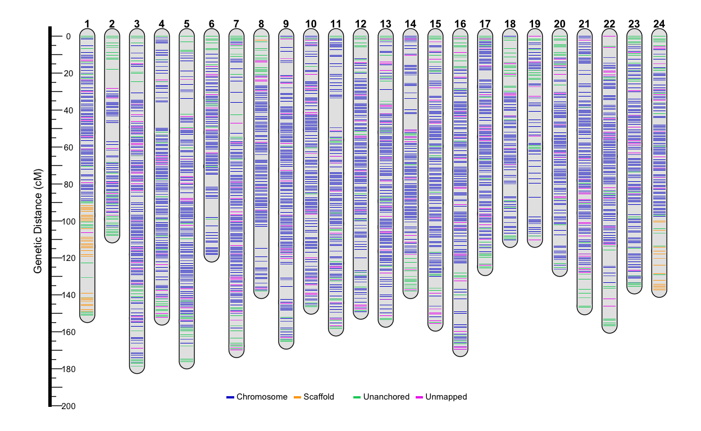
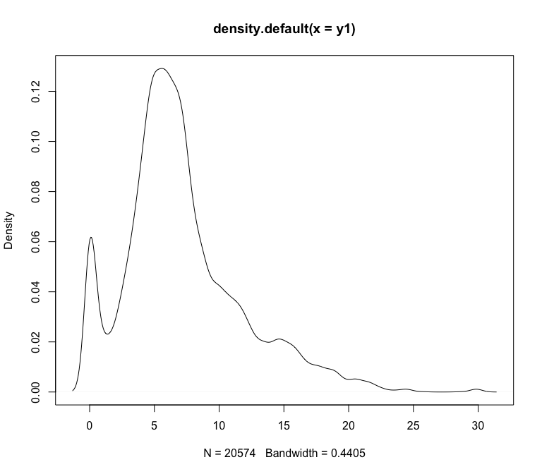

Linkage Maps Filter and Plot
================

-   [Georgia Female Linkage Map](#georgia-female-linkage-map)
-   [New York Female Linkage Map](#new-york-female-linkage-map)
-   [Hybrid F1 Female Linkage Map](#hybrid-f1-female-linkage-map)
-   [Edge Trimming with Lep-wrap](#edge-trimming-with-lep-wrap)
-   [Filter Female Linkage Maps](#filter-female-linkage-maps)
-   [Georgia Linkage Map Markers](#georgia-linkage-map-markers)
-   [Female Marey Maps](#female-marey-maps)
-   [Male Marey Maps](#male-marey-maps)
-   [ALLMAPS Results (anchored
    genome)](#allmaps-results-(anchored-genome))
-   [Flip and Calculate Recombination
    Rates](#flip-and-calculate-recombination-rates)
-   [Sex-specific Recombination Rates in
    Fishes](#sex-specific-recombination-rates-in-fishes)
-   [Population Differentiation (FST) at
    Inversions](#population-differentiation-(fst)-at-inversions)
-   [Normalize Recombination Rates and
    Compare](#normalize-recombination-rates-and-compare)

#### Georgia Female Linkage Map

<!-- -->

#### New York Female Linkage Map

<!-- -->

#### Hybrid F1 Female Linkage Map

<!-- -->

#### Edge Trimming with Lep-wrap

> [Lep-wrap
> script](https://github.com/pdimens/LepWrap/blob/main/rules/LepMap3/trim.smk)

<table>
<caption>
Edges Trimmed
</caption>
<thead>
<tr>
<th style="text-align:center;">
LG
</th>
<th style="text-align:center;">
n
</th>
</tr>
</thead>
<tbody>
<tr>
<td style="text-align:center;">
2
</td>
<td style="text-align:center;">
3
</td>
</tr>
<tr>
<td style="text-align:center;">
24
</td>
<td style="text-align:center;">
48
</td>
</tr>
</tbody>
</table>

<!-- -->

#### Filter Female Linkage Maps

    ## [1] "18285 markers in GA Linkage Map"

    ## [1] "18234 markers post trimming (51 removed)"

    ## [1] "12751 one SNP per RADtag (5534 removed)"

    ## [1] "20171 markers in NY Linkage Map"

    ## [1] "13941 one SNP per RADtag (6230 removed)"

    ## [1] "20627 markers in F1 Linkage Map"

    ## [1] "13019 one SNP per RADtag (7608 removed)"

    ##  medchr length_F1 length_NY markers_F1 markers_NY
    ##       1   170.011   170.888        886        928
    ##       2   138.815   118.857        339        513
    ##       3   128.265   201.987       1102       1033
    ##       4   127.724   154.960       1190        998
    ##       5   178.548   204.819       1034       1038
    ##       6   150.680   160.595        887       1093
    ##       7   176.358   174.851       1025       1020
    ##       8   109.858   162.068       1109        873
    ##       9   173.361   181.480        829        832
    ##      10   158.536   165.459        856        887
    ##      11   147.268   160.777       1061        983
    ##      12   156.124   163.474        747        811
    ##      13   155.928   160.364        880        894
    ##      14   145.962   158.683        923        856
    ##      15   175.945   177.323        842        837
    ##      16   131.134   187.153        597        899
    ##      17   144.727   146.738        806        809
    ##      18   126.385   141.602        920        559
    ##      19   152.188   145.693        622        770
    ##      20   141.958   131.822        688        700
    ##      21   148.691   152.249        836        785
    ##      22   165.978   162.465        521        848
    ##      23   125.999   122.931        736        622
    ##      24   124.123   162.257       1260        652
    ##   Total  3554.566  3869.495      20696      20240

    ##  medchr   length markers
    ##       1  150.889     784
    ##       2  120.963     444
    ##       3  178.500     924
    ##       4  152.271     988
    ##       5  177.452     934
    ##       6  118.141     995
    ##       7  169.865    1021
    ##       8  138.622     523
    ##       9  165.279     755
    ##      10  146.365     859
    ##      11  158.899     772
    ##      12  149.088     710
    ##      13  153.418     874
    ##      14  138.650     791
    ##      15  155.540     799
    ##      16  169.322     830
    ##      17  125.472     716
    ##      18  110.265     440
    ##      19  110.189     665
    ##      20  125.935     638
    ##      21  146.689     777
    ##      22  156.658     807
    ##      23  139.151     620
    ##      24  195.638     619
    ##   Total 3553.261   18285

    ## [1] "58859 post mismatch filter (173 removed)"

<table class=" lightable-paper" style="font-family: &quot;Arial Narrow&quot;, arial, helvetica, sans-serif; margin-left: auto; margin-right: auto;">
<thead>
<tr>
<th style="empty-cells: hide;border-bottom:hidden;" colspan="1">
</th>
<th style="border-bottom:hidden;padding-bottom:0; padding-left:3px;padding-right:3px;text-align: center; " colspan="2">

GA

</th>
<th style="border-bottom:hidden;padding-bottom:0; padding-left:3px;padding-right:3px;text-align: center; " colspan="2">

NY

</th>
<th style="border-bottom:hidden;padding-bottom:0; padding-left:3px;padding-right:3px;text-align: center; " colspan="2">

F1

</th>
</tr>
<tr>
<th style="text-align:left;">
group
</th>
<th style="text-align:right;">
GA\_cM
</th>
<th style="text-align:right;">
GA\_SNPs
</th>
<th style="text-align:right;">
NY\_cM
</th>
<th style="text-align:right;">
NY\_SNPs
</th>
<th style="text-align:right;">
F1\_cM
</th>
<th style="text-align:right;">
F1\_SNPs
</th>
</tr>
</thead>
<tbody>
<tr>
<td style="text-align:left;">
1
</td>
<td style="text-align:right;">
150.89
</td>
<td style="text-align:right;">
781
</td>
<td style="text-align:right;">
170.89
</td>
<td style="text-align:right;">
917
</td>
<td style="text-align:right;">
170.01
</td>
<td style="text-align:right;">
879
</td>
</tr>
<tr>
<td style="text-align:left;">
2
</td>
<td style="text-align:right;">
107.77
</td>
<td style="text-align:right;">
437
</td>
<td style="text-align:right;">
118.86
</td>
<td style="text-align:right;">
505
</td>
<td style="text-align:right;">
138.81
</td>
<td style="text-align:right;">
334
</td>
</tr>
<tr>
<td style="text-align:left;">
3
</td>
<td style="text-align:right;">
178.50
</td>
<td style="text-align:right;">
923
</td>
<td style="text-align:right;">
201.99
</td>
<td style="text-align:right;">
1030
</td>
<td style="text-align:right;">
119.91
</td>
<td style="text-align:right;">
1094
</td>
</tr>
<tr>
<td style="text-align:left;">
4
</td>
<td style="text-align:right;">
152.27
</td>
<td style="text-align:right;">
980
</td>
<td style="text-align:right;">
154.96
</td>
<td style="text-align:right;">
984
</td>
<td style="text-align:right;">
127.72
</td>
<td style="text-align:right;">
1182
</td>
</tr>
<tr>
<td style="text-align:left;">
5
</td>
<td style="text-align:right;">
177.45
</td>
<td style="text-align:right;">
929
</td>
<td style="text-align:right;">
204.82
</td>
<td style="text-align:right;">
1032
</td>
<td style="text-align:right;">
178.55
</td>
<td style="text-align:right;">
1030
</td>
</tr>
<tr>
<td style="text-align:left;">
6
</td>
<td style="text-align:right;">
118.14
</td>
<td style="text-align:right;">
994
</td>
<td style="text-align:right;">
160.59
</td>
<td style="text-align:right;">
1093
</td>
<td style="text-align:right;">
150.68
</td>
<td style="text-align:right;">
884
</td>
</tr>
<tr>
<td style="text-align:left;">
7
</td>
<td style="text-align:right;">
169.87
</td>
<td style="text-align:right;">
1015
</td>
<td style="text-align:right;">
174.85
</td>
<td style="text-align:right;">
997
</td>
<td style="text-align:right;">
176.36
</td>
<td style="text-align:right;">
1020
</td>
</tr>
<tr>
<td style="text-align:left;">
8
</td>
<td style="text-align:right;">
138.62
</td>
<td style="text-align:right;">
523
</td>
<td style="text-align:right;">
162.07
</td>
<td style="text-align:right;">
869
</td>
<td style="text-align:right;">
109.86
</td>
<td style="text-align:right;">
1106
</td>
</tr>
<tr>
<td style="text-align:left;">
9
</td>
<td style="text-align:right;">
165.28
</td>
<td style="text-align:right;">
755
</td>
<td style="text-align:right;">
181.48
</td>
<td style="text-align:right;">
829
</td>
<td style="text-align:right;">
173.36
</td>
<td style="text-align:right;">
826
</td>
</tr>
<tr>
<td style="text-align:left;">
10
</td>
<td style="text-align:right;">
146.37
</td>
<td style="text-align:right;">
853
</td>
<td style="text-align:right;">
165.46
</td>
<td style="text-align:right;">
882
</td>
<td style="text-align:right;">
158.54
</td>
<td style="text-align:right;">
852
</td>
</tr>
<tr>
<td style="text-align:left;">
11
</td>
<td style="text-align:right;">
158.90
</td>
<td style="text-align:right;">
771
</td>
<td style="text-align:right;">
160.78
</td>
<td style="text-align:right;">
977
</td>
<td style="text-align:right;">
147.27
</td>
<td style="text-align:right;">
1058
</td>
</tr>
<tr>
<td style="text-align:left;">
12
</td>
<td style="text-align:right;">
149.09
</td>
<td style="text-align:right;">
710
</td>
<td style="text-align:right;">
163.47
</td>
<td style="text-align:right;">
808
</td>
<td style="text-align:right;">
156.12
</td>
<td style="text-align:right;">
743
</td>
</tr>
<tr>
<td style="text-align:left;">
13
</td>
<td style="text-align:right;">
153.42
</td>
<td style="text-align:right;">
873
</td>
<td style="text-align:right;">
160.36
</td>
<td style="text-align:right;">
889
</td>
<td style="text-align:right;">
155.93
</td>
<td style="text-align:right;">
877
</td>
</tr>
<tr>
<td style="text-align:left;">
14
</td>
<td style="text-align:right;">
138.65
</td>
<td style="text-align:right;">
790
</td>
<td style="text-align:right;">
158.68
</td>
<td style="text-align:right;">
851
</td>
<td style="text-align:right;">
145.96
</td>
<td style="text-align:right;">
920
</td>
</tr>
<tr>
<td style="text-align:left;">
15
</td>
<td style="text-align:right;">
155.54
</td>
<td style="text-align:right;">
799
</td>
<td style="text-align:right;">
177.32
</td>
<td style="text-align:right;">
831
</td>
<td style="text-align:right;">
175.94
</td>
<td style="text-align:right;">
838
</td>
</tr>
<tr>
<td style="text-align:left;">
16
</td>
<td style="text-align:right;">
169.32
</td>
<td style="text-align:right;">
828
</td>
<td style="text-align:right;">
187.15
</td>
<td style="text-align:right;">
895
</td>
<td style="text-align:right;">
131.13
</td>
<td style="text-align:right;">
593
</td>
</tr>
<tr>
<td style="text-align:left;">
17
</td>
<td style="text-align:right;">
125.47
</td>
<td style="text-align:right;">
716
</td>
<td style="text-align:right;">
146.74
</td>
<td style="text-align:right;">
806
</td>
<td style="text-align:right;">
144.73
</td>
<td style="text-align:right;">
802
</td>
</tr>
<tr>
<td style="text-align:left;">
18
</td>
<td style="text-align:right;">
109.53
</td>
<td style="text-align:right;">
434
</td>
<td style="text-align:right;">
141.60
</td>
<td style="text-align:right;">
554
</td>
<td style="text-align:right;">
126.39
</td>
<td style="text-align:right;">
914
</td>
</tr>
<tr>
<td style="text-align:left;">
19
</td>
<td style="text-align:right;">
110.19
</td>
<td style="text-align:right;">
665
</td>
<td style="text-align:right;">
145.69
</td>
<td style="text-align:right;">
764
</td>
<td style="text-align:right;">
152.19
</td>
<td style="text-align:right;">
619
</td>
</tr>
<tr>
<td style="text-align:left;">
20
</td>
<td style="text-align:right;">
125.94
</td>
<td style="text-align:right;">
635
</td>
<td style="text-align:right;">
131.82
</td>
<td style="text-align:right;">
695
</td>
<td style="text-align:right;">
141.96
</td>
<td style="text-align:right;">
684
</td>
</tr>
<tr>
<td style="text-align:left;">
21
</td>
<td style="text-align:right;">
146.69
</td>
<td style="text-align:right;">
776
</td>
<td style="text-align:right;">
152.25
</td>
<td style="text-align:right;">
780
</td>
<td style="text-align:right;">
148.69
</td>
<td style="text-align:right;">
833
</td>
</tr>
<tr>
<td style="text-align:left;">
22
</td>
<td style="text-align:right;">
156.66
</td>
<td style="text-align:right;">
805
</td>
<td style="text-align:right;">
162.47
</td>
<td style="text-align:right;">
843
</td>
<td style="text-align:right;">
165.98
</td>
<td style="text-align:right;">
517
</td>
</tr>
<tr>
<td style="text-align:left;">
23
</td>
<td style="text-align:right;">
139.15
</td>
<td style="text-align:right;">
620
</td>
<td style="text-align:right;">
122.93
</td>
<td style="text-align:right;">
619
</td>
<td style="text-align:right;">
126.00
</td>
<td style="text-align:right;">
729
</td>
</tr>
<tr>
<td style="text-align:left;">
24
</td>
<td style="text-align:right;">
137.99
</td>
<td style="text-align:right;">
566
</td>
<td style="text-align:right;">
162.26
</td>
<td style="text-align:right;">
644
</td>
<td style="text-align:right;">
124.12
</td>
<td style="text-align:right;">
1253
</td>
</tr>
<tr>
<td style="text-align:left;">
Total
</td>
<td style="text-align:right;">
3481.69
</td>
<td style="text-align:right;">
18178
</td>
<td style="text-align:right;">
3869.49
</td>
<td style="text-align:right;">
20094
</td>
<td style="text-align:right;">
3546.21
</td>
<td style="text-align:right;">
20587
</td>
</tr>
</tbody>
</table>

    ## [1] "13891 post mismatch filter (50 removed)"

    ## [1] "12993 post mismatch filter (26 removed)"

#### Georgia Linkage Map Markers

<!-- -->
<table class=" lightable-paper" style="font-family: &quot;Arial Narrow&quot;, arial, helvetica, sans-serif; margin-left: auto; margin-right: auto;">
<thead>
<tr>
<th style="empty-cells: hide;border-bottom:hidden;" colspan="1">
</th>
<th style="border-bottom:hidden;padding-bottom:0; padding-left:3px;padding-right:3px;text-align: center; " colspan="2">

GA

</th>
<th style="border-bottom:hidden;padding-bottom:0; padding-left:3px;padding-right:3px;text-align: center; " colspan="2">

NY

</th>
<th style="border-bottom:hidden;padding-bottom:0; padding-left:3px;padding-right:3px;text-align: center; " colspan="2">

F1

</th>
</tr>
<tr>
<th style="text-align:left;">
group
</th>
<th style="text-align:right;">
GA\_cM
</th>
<th style="text-align:right;">
GA\_SNPs
</th>
<th style="text-align:right;">
NY\_cM
</th>
<th style="text-align:right;">
NY\_SNPs
</th>
<th style="text-align:right;">
F1\_cM
</th>
<th style="text-align:right;">
F1\_SNPs
</th>
</tr>
</thead>
<tbody>
<tr>
<td style="text-align:left;">
1
</td>
<td style="text-align:right;">
150.89
</td>
<td style="text-align:right;">
553
</td>
<td style="text-align:right;">
170.89
</td>
<td style="text-align:right;">
633
</td>
<td style="text-align:right;">
170.01
</td>
<td style="text-align:right;">
570
</td>
</tr>
<tr>
<td style="text-align:left;">
2
</td>
<td style="text-align:right;">
107.77
</td>
<td style="text-align:right;">
319
</td>
<td style="text-align:right;">
118.86
</td>
<td style="text-align:right;">
355
</td>
<td style="text-align:right;">
138.81
</td>
<td style="text-align:right;">
232
</td>
</tr>
<tr>
<td style="text-align:left;">
3
</td>
<td style="text-align:right;">
178.50
</td>
<td style="text-align:right;">
652
</td>
<td style="text-align:right;">
201.99
</td>
<td style="text-align:right;">
701
</td>
<td style="text-align:right;">
125.95
</td>
<td style="text-align:right;">
699
</td>
</tr>
<tr>
<td style="text-align:left;">
4
</td>
<td style="text-align:right;">
152.27
</td>
<td style="text-align:right;">
668
</td>
<td style="text-align:right;">
154.96
</td>
<td style="text-align:right;">
699
</td>
<td style="text-align:right;">
127.72
</td>
<td style="text-align:right;">
744
</td>
</tr>
<tr>
<td style="text-align:left;">
5
</td>
<td style="text-align:right;">
175.98
</td>
<td style="text-align:right;">
642
</td>
<td style="text-align:right;">
204.82
</td>
<td style="text-align:right;">
700
</td>
<td style="text-align:right;">
175.28
</td>
<td style="text-align:right;">
672
</td>
</tr>
<tr>
<td style="text-align:left;">
6
</td>
<td style="text-align:right;">
118.14
</td>
<td style="text-align:right;">
689
</td>
<td style="text-align:right;">
160.59
</td>
<td style="text-align:right;">
755
</td>
<td style="text-align:right;">
150.68
</td>
<td style="text-align:right;">
556
</td>
</tr>
<tr>
<td style="text-align:left;">
7
</td>
<td style="text-align:right;">
169.87
</td>
<td style="text-align:right;">
710
</td>
<td style="text-align:right;">
174.85
</td>
<td style="text-align:right;">
711
</td>
<td style="text-align:right;">
176.36
</td>
<td style="text-align:right;">
670
</td>
</tr>
<tr>
<td style="text-align:left;">
8
</td>
<td style="text-align:right;">
137.89
</td>
<td style="text-align:right;">
394
</td>
<td style="text-align:right;">
162.07
</td>
<td style="text-align:right;">
588
</td>
<td style="text-align:right;">
109.86
</td>
<td style="text-align:right;">
688
</td>
</tr>
<tr>
<td style="text-align:left;">
9
</td>
<td style="text-align:right;">
165.28
</td>
<td style="text-align:right;">
549
</td>
<td style="text-align:right;">
181.48
</td>
<td style="text-align:right;">
592
</td>
<td style="text-align:right;">
173.36
</td>
<td style="text-align:right;">
549
</td>
</tr>
<tr>
<td style="text-align:left;">
10
</td>
<td style="text-align:right;">
146.37
</td>
<td style="text-align:right;">
579
</td>
<td style="text-align:right;">
165.46
</td>
<td style="text-align:right;">
608
</td>
<td style="text-align:right;">
158.54
</td>
<td style="text-align:right;">
563
</td>
</tr>
<tr>
<td style="text-align:left;">
11
</td>
<td style="text-align:right;">
158.17
</td>
<td style="text-align:right;">
534
</td>
<td style="text-align:right;">
160.78
</td>
<td style="text-align:right;">
689
</td>
<td style="text-align:right;">
145.89
</td>
<td style="text-align:right;">
644
</td>
</tr>
<tr>
<td style="text-align:left;">
12
</td>
<td style="text-align:right;">
149.09
</td>
<td style="text-align:right;">
487
</td>
<td style="text-align:right;">
162.74
</td>
<td style="text-align:right;">
532
</td>
<td style="text-align:right;">
155.67
</td>
<td style="text-align:right;">
480
</td>
</tr>
<tr>
<td style="text-align:left;">
13
</td>
<td style="text-align:right;">
153.42
</td>
<td style="text-align:right;">
592
</td>
<td style="text-align:right;">
160.36
</td>
<td style="text-align:right;">
614
</td>
<td style="text-align:right;">
155.93
</td>
<td style="text-align:right;">
557
</td>
</tr>
<tr>
<td style="text-align:left;">
14
</td>
<td style="text-align:right;">
137.92
</td>
<td style="text-align:right;">
569
</td>
<td style="text-align:right;">
157.95
</td>
<td style="text-align:right;">
587
</td>
<td style="text-align:right;">
145.96
</td>
<td style="text-align:right;">
595
</td>
</tr>
<tr>
<td style="text-align:left;">
15
</td>
<td style="text-align:right;">
155.54
</td>
<td style="text-align:right;">
559
</td>
<td style="text-align:right;">
177.32
</td>
<td style="text-align:right;">
600
</td>
<td style="text-align:right;">
175.94
</td>
<td style="text-align:right;">
543
</td>
</tr>
<tr>
<td style="text-align:left;">
16
</td>
<td style="text-align:right;">
169.32
</td>
<td style="text-align:right;">
598
</td>
<td style="text-align:right;">
187.15
</td>
<td style="text-align:right;">
634
</td>
<td style="text-align:right;">
131.13
</td>
<td style="text-align:right;">
367
</td>
</tr>
<tr>
<td style="text-align:left;">
17
</td>
<td style="text-align:right;">
125.47
</td>
<td style="text-align:right;">
504
</td>
<td style="text-align:right;">
146.01
</td>
<td style="text-align:right;">
554
</td>
<td style="text-align:right;">
143.81
</td>
<td style="text-align:right;">
524
</td>
</tr>
<tr>
<td style="text-align:left;">
18
</td>
<td style="text-align:right;">
110.27
</td>
<td style="text-align:right;">
299
</td>
<td style="text-align:right;">
141.60
</td>
<td style="text-align:right;">
374
</td>
<td style="text-align:right;">
126.39
</td>
<td style="text-align:right;">
480
</td>
</tr>
<tr>
<td style="text-align:left;">
19
</td>
<td style="text-align:right;">
110.19
</td>
<td style="text-align:right;">
477
</td>
<td style="text-align:right;">
145.69
</td>
<td style="text-align:right;">
518
</td>
<td style="text-align:right;">
152.19
</td>
<td style="text-align:right;">
398
</td>
</tr>
<tr>
<td style="text-align:left;">
20
</td>
<td style="text-align:right;">
125.94
</td>
<td style="text-align:right;">
454
</td>
<td style="text-align:right;">
131.09
</td>
<td style="text-align:right;">
473
</td>
<td style="text-align:right;">
129.13
</td>
<td style="text-align:right;">
463
</td>
</tr>
<tr>
<td style="text-align:left;">
21
</td>
<td style="text-align:right;">
146.69
</td>
<td style="text-align:right;">
525
</td>
<td style="text-align:right;">
152.25
</td>
<td style="text-align:right;">
552
</td>
<td style="text-align:right;">
148.69
</td>
<td style="text-align:right;">
524
</td>
</tr>
<tr>
<td style="text-align:left;">
22
</td>
<td style="text-align:right;">
156.66
</td>
<td style="text-align:right;">
550
</td>
<td style="text-align:right;">
162.47
</td>
<td style="text-align:right;">
599
</td>
<td style="text-align:right;">
165.06
</td>
<td style="text-align:right;">
364
</td>
</tr>
<tr>
<td style="text-align:left;">
23
</td>
<td style="text-align:right;">
135.39
</td>
<td style="text-align:right;">
422
</td>
<td style="text-align:right;">
122.93
</td>
<td style="text-align:right;">
410
</td>
<td style="text-align:right;">
126.00
</td>
<td style="text-align:right;">
437
</td>
</tr>
<tr>
<td style="text-align:left;">
24
</td>
<td style="text-align:right;">
137.25
</td>
<td style="text-align:right;">
426
</td>
<td style="text-align:right;">
162.26
</td>
<td style="text-align:right;">
463
</td>
<td style="text-align:right;">
121.81
</td>
<td style="text-align:right;">
700
</td>
</tr>
<tr>
<td style="text-align:left;">
Total
</td>
<td style="text-align:right;">
3474.26
</td>
<td style="text-align:right;">
12751
</td>
<td style="text-align:right;">
3866.57
</td>
<td style="text-align:right;">
13941
</td>
<td style="text-align:right;">
3530.18
</td>
<td style="text-align:right;">
13019
</td>
</tr>
</tbody>
</table>

#### Female Marey Maps

<!-- -->

<!-- -->

<!-- -->

<table class=" lightable-paper" style="font-family: &quot;Arial Narrow&quot;, arial, helvetica, sans-serif; margin-left: auto; margin-right: auto;">
<thead>
<tr>
<th style="empty-cells: hide;border-bottom:hidden;" colspan="1">
</th>
<th style="border-bottom:hidden;padding-bottom:0; padding-left:3px;padding-right:3px;text-align: center; " colspan="2">

GA

</th>
<th style="border-bottom:hidden;padding-bottom:0; padding-left:3px;padding-right:3px;text-align: center; " colspan="2">

NY

</th>
<th style="border-bottom:hidden;padding-bottom:0; padding-left:3px;padding-right:3px;text-align: center; " colspan="2">

F1

</th>
</tr>
<tr>
<th style="text-align:left;">
group
</th>
<th style="text-align:right;">
GA\_cM
</th>
<th style="text-align:right;">
GA\_SNPs
</th>
<th style="text-align:right;">
NY\_cM
</th>
<th style="text-align:right;">
NY\_SNPs
</th>
<th style="text-align:right;">
F1\_cM
</th>
<th style="text-align:right;">
F1\_SNPs
</th>
</tr>
</thead>
<tbody>
<tr>
<td style="text-align:left;">
1
</td>
<td style="text-align:right;">
147.97
</td>
<td style="text-align:right;">
474
</td>
<td style="text-align:right;">
167.96
</td>
<td style="text-align:right;">
513
</td>
<td style="text-align:right;">
162.73
</td>
<td style="text-align:right;">
482
</td>
</tr>
<tr>
<td style="text-align:left;">
2
</td>
<td style="text-align:right;">
72.83
</td>
<td style="text-align:right;">
255
</td>
<td style="text-align:right;">
75.35
</td>
<td style="text-align:right;">
261
</td>
<td style="text-align:right;">
66.83
</td>
<td style="text-align:right;">
179
</td>
</tr>
<tr>
<td style="text-align:left;">
3
</td>
<td style="text-align:right;">
177.03
</td>
<td style="text-align:right;">
566
</td>
<td style="text-align:right;">
199.76
</td>
<td style="text-align:right;">
597
</td>
<td style="text-align:right;">
113.48
</td>
<td style="text-align:right;">
612
</td>
</tr>
<tr>
<td style="text-align:left;">
4
</td>
<td style="text-align:right;">
143.48
</td>
<td style="text-align:right;">
591
</td>
<td style="text-align:right;">
143.15
</td>
<td style="text-align:right;">
615
</td>
<td style="text-align:right;">
120.89
</td>
<td style="text-align:right;">
680
</td>
</tr>
<tr>
<td style="text-align:left;">
5
</td>
<td style="text-align:right;">
163.84
</td>
<td style="text-align:right;">
584
</td>
<td style="text-align:right;">
170.71
</td>
<td style="text-align:right;">
615
</td>
<td style="text-align:right;">
153.09
</td>
<td style="text-align:right;">
607
</td>
</tr>
<tr>
<td style="text-align:left;">
6
</td>
<td style="text-align:right;">
115.94
</td>
<td style="text-align:right;">
636
</td>
<td style="text-align:right;">
155.47
</td>
<td style="text-align:right;">
678
</td>
<td style="text-align:right;">
141.63
</td>
<td style="text-align:right;">
523
</td>
</tr>
<tr>
<td style="text-align:left;">
7
</td>
<td style="text-align:right;">
146.97
</td>
<td style="text-align:right;">
623
</td>
<td style="text-align:right;">
158.00
</td>
<td style="text-align:right;">
595
</td>
<td style="text-align:right;">
150.46
</td>
<td style="text-align:right;">
591
</td>
</tr>
<tr>
<td style="text-align:left;">
8
</td>
<td style="text-align:right;">
119.38
</td>
<td style="text-align:right;">
340
</td>
<td style="text-align:right;">
140.43
</td>
<td style="text-align:right;">
516
</td>
<td style="text-align:right;">
97.97
</td>
<td style="text-align:right;">
626
</td>
</tr>
<tr>
<td style="text-align:left;">
9
</td>
<td style="text-align:right;">
165.28
</td>
<td style="text-align:right;">
504
</td>
<td style="text-align:right;">
180.75
</td>
<td style="text-align:right;">
535
</td>
<td style="text-align:right;">
169.23
</td>
<td style="text-align:right;">
513
</td>
</tr>
<tr>
<td style="text-align:left;">
10
</td>
<td style="text-align:right;">
146.37
</td>
<td style="text-align:right;">
541
</td>
<td style="text-align:right;">
163.26
</td>
<td style="text-align:right;">
545
</td>
<td style="text-align:right;">
142.70
</td>
<td style="text-align:right;">
518
</td>
</tr>
<tr>
<td style="text-align:left;">
11
</td>
<td style="text-align:right;">
158.17
</td>
<td style="text-align:right;">
447
</td>
<td style="text-align:right;">
158.59
</td>
<td style="text-align:right;">
566
</td>
<td style="text-align:right;">
144.07
</td>
<td style="text-align:right;">
555
</td>
</tr>
<tr>
<td style="text-align:left;">
12
</td>
<td style="text-align:right;">
137.04
</td>
<td style="text-align:right;">
434
</td>
<td style="text-align:right;">
144.82
</td>
<td style="text-align:right;">
462
</td>
<td style="text-align:right;">
143.70
</td>
<td style="text-align:right;">
430
</td>
</tr>
<tr>
<td style="text-align:left;">
13
</td>
<td style="text-align:right;">
153.42
</td>
<td style="text-align:right;">
532
</td>
<td style="text-align:right;">
158.90
</td>
<td style="text-align:right;">
540
</td>
<td style="text-align:right;">
141.74
</td>
<td style="text-align:right;">
510
</td>
</tr>
<tr>
<td style="text-align:left;">
14
</td>
<td style="text-align:right;">
120.24
</td>
<td style="text-align:right;">
511
</td>
<td style="text-align:right;">
121.52
</td>
<td style="text-align:right;">
510
</td>
<td style="text-align:right;">
126.13
</td>
<td style="text-align:right;">
538
</td>
</tr>
<tr>
<td style="text-align:left;">
15
</td>
<td style="text-align:right;">
149.66
</td>
<td style="text-align:right;">
505
</td>
<td style="text-align:right;">
170.68
</td>
<td style="text-align:right;">
530
</td>
<td style="text-align:right;">
169.05
</td>
<td style="text-align:right;">
499
</td>
</tr>
<tr>
<td style="text-align:left;">
16
</td>
<td style="text-align:right;">
153.04
</td>
<td style="text-align:right;">
532
</td>
<td style="text-align:right;">
165.63
</td>
<td style="text-align:right;">
566
</td>
<td style="text-align:right;">
109.14
</td>
<td style="text-align:right;">
318
</td>
</tr>
<tr>
<td style="text-align:left;">
17
</td>
<td style="text-align:right;">
116.67
</td>
<td style="text-align:right;">
428
</td>
<td style="text-align:right;">
137.20
</td>
<td style="text-align:right;">
468
</td>
<td style="text-align:right;">
133.76
</td>
<td style="text-align:right;">
446
</td>
</tr>
<tr>
<td style="text-align:left;">
18
</td>
<td style="text-align:right;">
79.73
</td>
<td style="text-align:right;">
217
</td>
<td style="text-align:right;">
118.80
</td>
<td style="text-align:right;">
288
</td>
<td style="text-align:right;">
96.42
</td>
<td style="text-align:right;">
402
</td>
</tr>
<tr>
<td style="text-align:left;">
19
</td>
<td style="text-align:right;">
108.72
</td>
<td style="text-align:right;">
428
</td>
<td style="text-align:right;">
100.69
</td>
<td style="text-align:right;">
421
</td>
<td style="text-align:right;">
119.48
</td>
<td style="text-align:right;">
355
</td>
</tr>
<tr>
<td style="text-align:left;">
20
</td>
<td style="text-align:right;">
114.14
</td>
<td style="text-align:right;">
410
</td>
<td style="text-align:right;">
118.55
</td>
<td style="text-align:right;">
409
</td>
<td style="text-align:right;">
112.97
</td>
<td style="text-align:right;">
417
</td>
</tr>
<tr>
<td style="text-align:left;">
21
</td>
<td style="text-align:right;">
127.17
</td>
<td style="text-align:right;">
461
</td>
<td style="text-align:right;">
127.79
</td>
<td style="text-align:right;">
459
</td>
<td style="text-align:right;">
118.59
</td>
<td style="text-align:right;">
456
</td>
</tr>
<tr>
<td style="text-align:left;">
22
</td>
<td style="text-align:right;">
127.96
</td>
<td style="text-align:right;">
496
</td>
<td style="text-align:right;">
136.73
</td>
<td style="text-align:right;">
527
</td>
<td style="text-align:right;">
135.05
</td>
<td style="text-align:right;">
314
</td>
</tr>
<tr>
<td style="text-align:left;">
23
</td>
<td style="text-align:right;">
129.54
</td>
<td style="text-align:right;">
358
</td>
<td style="text-align:right;">
120.00
</td>
<td style="text-align:right;">
330
</td>
<td style="text-align:right;">
122.30
</td>
<td style="text-align:right;">
377
</td>
</tr>
<tr>
<td style="text-align:left;">
24
</td>
<td style="text-align:right;">
127.69
</td>
<td style="text-align:right;">
362
</td>
<td style="text-align:right;">
147.44
</td>
<td style="text-align:right;">
382
</td>
<td style="text-align:right;">
108.47
</td>
<td style="text-align:right;">
637
</td>
</tr>
<tr>
<td style="text-align:left;">
Total
</td>
<td style="text-align:right;">
3202.27
</td>
<td style="text-align:right;">
11235
</td>
<td style="text-align:right;">
3482.20
</td>
<td style="text-align:right;">
11928
</td>
<td style="text-align:right;">
3099.85
</td>
<td style="text-align:right;">
11585
</td>
</tr>
</tbody>
</table>

<!-- -->

#### Male Marey Maps

    ##  medchr   length markers
    ##       1   88.825     870
    ##       2   30.436     416
    ##       3   69.898    1093
    ##       4   54.943    1019
    ##       5   63.908     943
    ##       6   52.732    1064
    ##       7   54.577    1027
    ##       8   57.861     943
    ##       9   74.058     876
    ##      10   50.334     839
    ##      11   53.279     959
    ##      12   53.570     759
    ##      13   79.828     845
    ##      14   60.552     811
    ##      15  102.734     816
    ##      16   80.760     906
    ##      17   59.540     780
    ##      18   60.838     460
    ##      19   55.235     670
    ##      20   51.446     706
    ##      21   60.242     781
    ##      22   67.618     778
    ##      23   66.702     657
    ##      24   61.319     644
    ##   Total 1511.235   19662

    ## [1] "19662 markers in GA Male Linkage Map"

    ## [1] "18191 map to genome (1471 removed)"

    ## [1] "12544 one SNP per RADtag (5647 removed)"

    ## [1] "11585 scaffolds >1Mb (959 removed)"

    ##  medchr   length markers
    ##       1  112.679     887
    ##       2   58.012     432
    ##       3   63.926    1024
    ##       4   68.835     995
    ##       5   69.599     986
    ##       6   72.147    1011
    ##       7   49.756    1043
    ##       8   57.558    1144
    ##       9   74.991     817
    ##      10   61.671     867
    ##      11   49.874    1033
    ##      12   58.714     775
    ##      13   88.069     851
    ##      14   54.647     856
    ##      15   60.495     796
    ##      16   63.510     912
    ##      17   63.056     774
    ##      18   60.832     526
    ##      19   62.301     685
    ##      20   55.854     644
    ##      21   66.525     721
    ##      22   76.748     797
    ##      23   81.158     620
    ##      24  116.110     624
    ##   Total 1647.067   19820

    ## [1] "19820 markers in NY Male Linkage Map"

    ## [1] "18757 map to genome (1063 removed)"

    ## [1] "12753 one SNP per RADtag (6004 removed)"

    ## [1] "11839 scaffolds >1Mb (914 removed)"

    ##  medchr length_GA length_NY markers_GA markers_NY
    ##       1    33.838    37.630        470        488
    ##       2    16.943    12.474        232        244
    ##       3    56.571    22.463        623        591
    ##       4     4.379    21.955        634        600
    ##       5    22.288    37.072        558        622
    ##       6    45.230    62.526        674        615
    ##       7     3.650     4.379        588        631
    ##       8     6.581    11.071        547        646
    ##       9    37.176    49.933        559        521
    ##      10    46.673    60.200        511        543
    ##      11    34.776    34.380        532        585
    ##      12    35.833     9.566        476        445
    ##      13    24.492    24.564        501        526
    ##      14     2.920     8.198        487        506
    ##      15    23.577    28.409        500        525
    ##      16    36.428     8.073        571        565
    ##      17     7.321    12.564        446        450
    ##      18     5.850     7.376        242        267
    ##      19    23.740    32.686        384        416
    ##      20     7.332     9.658        421        410
    ##      21     7.398    14.775        419        434
    ##      22    45.488    52.561        484        504
    ##      23    28.012    26.633        342        349
    ##      24    14.787    17.706        384        356
    ##   Total   571.283   606.852      11585      11839

<!-- --><!-- -->

#### ALLMAPS Results (anchored genome)

<table class=" lightable-paper" style="font-family: &quot;Arial Narrow&quot;, arial, helvetica, sans-serif; margin-left: auto; margin-right: auto;">
<thead>
<tr>
<th style="empty-cells: hide;border-bottom:hidden;" colspan="1">
</th>
<th style="border-bottom:hidden;padding-bottom:0; padding-left:3px;padding-right:3px;text-align: center; " colspan="2">

GA

</th>
<th style="border-bottom:hidden;padding-bottom:0; padding-left:3px;padding-right:3px;text-align: center; " colspan="2">

NY

</th>
<th style="border-bottom:hidden;padding-bottom:0; padding-left:3px;padding-right:3px;text-align: center; " colspan="2">

F1

</th>
</tr>
<tr>
<th style="text-align:left;">
group
</th>
<th style="text-align:right;">
GA\_cM
</th>
<th style="text-align:right;">
GA\_SNPs
</th>
<th style="text-align:right;">
NY\_cM
</th>
<th style="text-align:right;">
NY\_SNPs
</th>
<th style="text-align:right;">
F1\_cM
</th>
<th style="text-align:right;">
F1\_SNPs
</th>
</tr>
</thead>
<tbody>
<tr>
<td style="text-align:left;">
1
</td>
<td style="text-align:right;">
147.97
</td>
<td style="text-align:right;">
474
</td>
<td style="text-align:right;">
167.96
</td>
<td style="text-align:right;">
513
</td>
<td style="text-align:right;">
162.73
</td>
<td style="text-align:right;">
482
</td>
</tr>
<tr>
<td style="text-align:left;">
2
</td>
<td style="text-align:right;">
72.83
</td>
<td style="text-align:right;">
255
</td>
<td style="text-align:right;">
75.36
</td>
<td style="text-align:right;">
261
</td>
<td style="text-align:right;">
66.83
</td>
<td style="text-align:right;">
179
</td>
</tr>
<tr>
<td style="text-align:left;">
3
</td>
<td style="text-align:right;">
177.03
</td>
<td style="text-align:right;">
566
</td>
<td style="text-align:right;">
199.76
</td>
<td style="text-align:right;">
597
</td>
<td style="text-align:right;">
113.48
</td>
<td style="text-align:right;">
612
</td>
</tr>
<tr>
<td style="text-align:left;">
4
</td>
<td style="text-align:right;">
143.48
</td>
<td style="text-align:right;">
591
</td>
<td style="text-align:right;">
143.15
</td>
<td style="text-align:right;">
615
</td>
<td style="text-align:right;">
120.89
</td>
<td style="text-align:right;">
680
</td>
</tr>
<tr>
<td style="text-align:left;">
5
</td>
<td style="text-align:right;">
163.84
</td>
<td style="text-align:right;">
584
</td>
<td style="text-align:right;">
170.71
</td>
<td style="text-align:right;">
615
</td>
<td style="text-align:right;">
153.09
</td>
<td style="text-align:right;">
607
</td>
</tr>
<tr>
<td style="text-align:left;">
6
</td>
<td style="text-align:right;">
115.94
</td>
<td style="text-align:right;">
636
</td>
<td style="text-align:right;">
155.47
</td>
<td style="text-align:right;">
678
</td>
<td style="text-align:right;">
141.63
</td>
<td style="text-align:right;">
523
</td>
</tr>
<tr>
<td style="text-align:left;">
7
</td>
<td style="text-align:right;">
146.97
</td>
<td style="text-align:right;">
623
</td>
<td style="text-align:right;">
158.00
</td>
<td style="text-align:right;">
595
</td>
<td style="text-align:right;">
150.46
</td>
<td style="text-align:right;">
591
</td>
</tr>
<tr>
<td style="text-align:left;">
8
</td>
<td style="text-align:right;">
119.38
</td>
<td style="text-align:right;">
340
</td>
<td style="text-align:right;">
140.43
</td>
<td style="text-align:right;">
516
</td>
<td style="text-align:right;">
97.97
</td>
<td style="text-align:right;">
626
</td>
</tr>
<tr>
<td style="text-align:left;">
9
</td>
<td style="text-align:right;">
165.28
</td>
<td style="text-align:right;">
504
</td>
<td style="text-align:right;">
180.75
</td>
<td style="text-align:right;">
535
</td>
<td style="text-align:right;">
169.23
</td>
<td style="text-align:right;">
513
</td>
</tr>
<tr>
<td style="text-align:left;">
10
</td>
<td style="text-align:right;">
146.37
</td>
<td style="text-align:right;">
541
</td>
<td style="text-align:right;">
163.26
</td>
<td style="text-align:right;">
545
</td>
<td style="text-align:right;">
142.70
</td>
<td style="text-align:right;">
518
</td>
</tr>
<tr>
<td style="text-align:left;">
11
</td>
<td style="text-align:right;">
158.17
</td>
<td style="text-align:right;">
447
</td>
<td style="text-align:right;">
158.59
</td>
<td style="text-align:right;">
565
</td>
<td style="text-align:right;">
144.07
</td>
<td style="text-align:right;">
555
</td>
</tr>
<tr>
<td style="text-align:left;">
12
</td>
<td style="text-align:right;">
137.04
</td>
<td style="text-align:right;">
434
</td>
<td style="text-align:right;">
144.82
</td>
<td style="text-align:right;">
462
</td>
<td style="text-align:right;">
143.70
</td>
<td style="text-align:right;">
430
</td>
</tr>
<tr>
<td style="text-align:left;">
13
</td>
<td style="text-align:right;">
153.42
</td>
<td style="text-align:right;">
532
</td>
<td style="text-align:right;">
158.90
</td>
<td style="text-align:right;">
540
</td>
<td style="text-align:right;">
141.74
</td>
<td style="text-align:right;">
510
</td>
</tr>
<tr>
<td style="text-align:left;">
14
</td>
<td style="text-align:right;">
120.24
</td>
<td style="text-align:right;">
511
</td>
<td style="text-align:right;">
121.52
</td>
<td style="text-align:right;">
510
</td>
<td style="text-align:right;">
126.13
</td>
<td style="text-align:right;">
538
</td>
</tr>
<tr>
<td style="text-align:left;">
15
</td>
<td style="text-align:right;">
149.66
</td>
<td style="text-align:right;">
505
</td>
<td style="text-align:right;">
170.68
</td>
<td style="text-align:right;">
530
</td>
<td style="text-align:right;">
169.05
</td>
<td style="text-align:right;">
499
</td>
</tr>
<tr>
<td style="text-align:left;">
16
</td>
<td style="text-align:right;">
153.04
</td>
<td style="text-align:right;">
532
</td>
<td style="text-align:right;">
165.63
</td>
<td style="text-align:right;">
566
</td>
<td style="text-align:right;">
109.14
</td>
<td style="text-align:right;">
318
</td>
</tr>
<tr>
<td style="text-align:left;">
17
</td>
<td style="text-align:right;">
116.67
</td>
<td style="text-align:right;">
428
</td>
<td style="text-align:right;">
137.21
</td>
<td style="text-align:right;">
468
</td>
<td style="text-align:right;">
133.76
</td>
<td style="text-align:right;">
446
</td>
</tr>
<tr>
<td style="text-align:left;">
18
</td>
<td style="text-align:right;">
79.73
</td>
<td style="text-align:right;">
217
</td>
<td style="text-align:right;">
118.80
</td>
<td style="text-align:right;">
288
</td>
<td style="text-align:right;">
96.42
</td>
<td style="text-align:right;">
402
</td>
</tr>
<tr>
<td style="text-align:left;">
19
</td>
<td style="text-align:right;">
108.72
</td>
<td style="text-align:right;">
428
</td>
<td style="text-align:right;">
100.69
</td>
<td style="text-align:right;">
421
</td>
<td style="text-align:right;">
119.48
</td>
<td style="text-align:right;">
355
</td>
</tr>
<tr>
<td style="text-align:left;">
20
</td>
<td style="text-align:right;">
114.14
</td>
<td style="text-align:right;">
410
</td>
<td style="text-align:right;">
118.55
</td>
<td style="text-align:right;">
409
</td>
<td style="text-align:right;">
112.97
</td>
<td style="text-align:right;">
417
</td>
</tr>
<tr>
<td style="text-align:left;">
21
</td>
<td style="text-align:right;">
127.17
</td>
<td style="text-align:right;">
461
</td>
<td style="text-align:right;">
127.79
</td>
<td style="text-align:right;">
459
</td>
<td style="text-align:right;">
118.58
</td>
<td style="text-align:right;">
456
</td>
</tr>
<tr>
<td style="text-align:left;">
22
</td>
<td style="text-align:right;">
127.96
</td>
<td style="text-align:right;">
496
</td>
<td style="text-align:right;">
136.73
</td>
<td style="text-align:right;">
527
</td>
<td style="text-align:right;">
135.05
</td>
<td style="text-align:right;">
314
</td>
</tr>
<tr>
<td style="text-align:left;">
23
</td>
<td style="text-align:right;">
129.54
</td>
<td style="text-align:right;">
358
</td>
<td style="text-align:right;">
120.00
</td>
<td style="text-align:right;">
330
</td>
<td style="text-align:right;">
122.30
</td>
<td style="text-align:right;">
377
</td>
</tr>
<tr>
<td style="text-align:left;">
24
</td>
<td style="text-align:right;">
127.69
</td>
<td style="text-align:right;">
362
</td>
<td style="text-align:right;">
147.44
</td>
<td style="text-align:right;">
382
</td>
<td style="text-align:right;">
108.47
</td>
<td style="text-align:right;">
637
</td>
</tr>
<tr>
<td style="text-align:left;">
Total
</td>
<td style="text-align:right;">
3202.27
</td>
<td style="text-align:right;">
11235
</td>
<td style="text-align:right;">
3482.20
</td>
<td style="text-align:right;">
11927
</td>
<td style="text-align:right;">
3099.85
</td>
<td style="text-align:right;">
11585
</td>
</tr>
</tbody>
</table>

<!-- --><!-- -->

#### Flip and Calculate Recombination Rates

<!-- --><!-- -->

#### Sex-specific Recombination Rates in Fishes

<!-- -->

<!-- -->

#### Population Differentiation (FST) at Inversions

<!-- -->

#### Normalize Recombination Rates and Compare

<!-- --><!-- -->

    ## Shaprio-Wilk and Shapiro-Francia tests cannot be computed for  sample size > 5000.
    ##  Use random subsample of size 5000 instead.

    ## $seed
    ## [1] 746787
    ## 
    ## $shapiro.wilk
    ## 
    ##  Shapiro-Wilk normality test
    ## 
    ## data:  data.test
    ## W = 0.93654, p-value < 2.2e-16
    ## 
    ## 
    ## $shapiro.francia
    ## [1] NA
    ## 
    ## $anderson.darling
    ## [1] NA

    ## Making data Gaussian.
    ## Estimating parameters for 1 variables (will take ~5.4 seconds). 
    ## Converting to Gaussianized input data.
    ## Done!

<!-- -->

    ## Shaprio-Wilk and Shapiro-Francia tests cannot be computed for  sample size > 5000.
    ##  Use random subsample of size 5000 instead.

    ## $seed
    ## [1] 811189
    ## 
    ## $shapiro.wilk
    ## 
    ##  Shapiro-Wilk normality test
    ## 
    ## data:  data.test
    ## W = 0.97339, p-value < 2.2e-16
    ## 
    ## 
    ## $shapiro.francia
    ## [1] NA
    ## 
    ## $anderson.darling
    ## [1] NA

Show results

    ## Linear mixed model fit by REML. t-tests use Satterthwaite's method [
    ## lmerModLmerTest]
    ## Formula: transrr ~ type + (1 | chromosome)
    ##    Data: newr5
    ## 
    ## REML criterion at convergence: 56799
    ## 
    ## Scaled residuals: 
    ##     Min      1Q  Median      3Q     Max 
    ## -3.1375 -0.5603 -0.0549  0.4932  3.0243 
    ## 
    ## Random effects:
    ##  Groups     Name        Variance Std.Dev.
    ##  chromosome (Intercept)  0.7388  0.8595  
    ##  Residual               11.4117  3.3781  
    ## Number of obs: 10762, groups:  chromosome, 15
    ## 
    ## Fixed effects:
    ##               Estimate Std. Error      df t value Pr(>|t|)    
    ## (Intercept)     6.5984     0.2749 12.9372  24.005 4.11e-12 ***
    ## typeinversion  -0.1203     0.4762 12.9520  -0.253    0.805    
    ## ---
    ## Signif. codes:  0 '***' 0.001 '**' 0.01 '*' 0.05 '.' 0.1 ' ' 1
    ## 
    ## Correlation of Fixed Effects:
    ##             (Intr)
    ## typeinversn -0.577

    ## Type III Analysis of Variance Table with Satterthwaite's method
    ##       Sum Sq Mean Sq NumDF  DenDF F value Pr(>F)
    ## type 0.72767 0.72767     1 12.952  0.0638 0.8046

    ## $`emmeans of type`
    ##  type      emmean    SE  df asymp.LCL asymp.UCL
    ##  co-linear   6.60 0.275 Inf      6.06      7.14
    ##  inversion   6.48 0.389 Inf      5.72      7.24
    ## 
    ## Degrees-of-freedom method: asymptotic 
    ## Confidence level used: 0.95 
    ## 
    ## $`pairwise differences of type`
    ##  1                       estimate    SE  df z.ratio p.value
    ##  (co-linear) - inversion     0.12 0.476 Inf   0.253  0.8006
    ## 
    ## Degrees-of-freedom method: asymptotic

    ## Linear mixed model fit by REML. t-tests use Satterthwaite's method [
    ## lmerModLmerTest]
    ## Formula: transrr ~ population * region + (1 | chromosome)
    ##    Data: newx
    ## 
    ## REML criterion at convergence: 111446.4
    ## 
    ## Scaled residuals: 
    ##     Min      1Q  Median      3Q     Max 
    ## -3.3837 -0.6237 -0.0582  0.5503  4.4510 
    ## 
    ## Random effects:
    ##  Groups     Name        Variance Std.Dev.
    ##  chromosome (Intercept)  0.7997  0.8942  
    ##  Residual               13.1312  3.6237  
    ## Number of obs: 20574, groups:  chromosome, 15
    ## 
    ## Fixed effects:
    ##                                   Estimate Std. Error         df t value
    ## (Intercept)                      6.777e+00  2.425e-01  1.592e+01  27.951
    ## populationGA                    -1.031e-01  8.759e-02  2.055e+04  -1.177
    ## populationNY                     4.029e-01  8.705e-02  2.055e+04   4.629
    ## regionInv-Adjacent              -1.363e+00  1.754e-01  1.122e+04  -7.771
    ## regionInversion                 -7.858e+00  1.700e-01  9.305e+03 -46.231
    ## regionTerminal                   2.857e+00  1.243e-01  1.923e+04  22.988
    ## populationGA:regionInv-Adjacent  3.398e-01  1.835e-01  2.055e+04   1.852
    ## populationNY:regionInv-Adjacent  6.055e-01  1.812e-01  2.055e+04   3.342
    ## populationGA:regionInversion     6.011e+00  1.884e-01  2.055e+04  31.908
    ## populationNY:regionInversion     6.278e+00  1.794e-01  2.055e+04  35.000
    ## populationGA:regionTerminal     -3.234e-01  1.650e-01  2.055e+04  -1.960
    ## populationNY:regionTerminal     -6.591e-01  1.631e-01  2.055e+04  -4.040
    ##                                 Pr(>|t|)    
    ## (Intercept)                     5.90e-15 ***
    ## populationGA                    0.239093    
    ## populationNY                    3.70e-06 ***
    ## regionInv-Adjacent              8.46e-15 ***
    ## regionInversion                  < 2e-16 ***
    ## regionTerminal                   < 2e-16 ***
    ## populationGA:regionInv-Adjacent 0.064011 .  
    ## populationNY:regionInv-Adjacent 0.000833 ***
    ## populationGA:regionInversion     < 2e-16 ***
    ## populationNY:regionInversion     < 2e-16 ***
    ## populationGA:regionTerminal     0.049997 *  
    ## populationNY:regionTerminal     5.37e-05 ***
    ## ---
    ## Signif. codes:  0 '***' 0.001 '**' 0.01 '*' 0.05 '.' 0.1 ' ' 1
    ## 
    ## Correlation of Fixed Effects:
    ##             (Intr) ppltGA ppltNY rgnI-A rgnInv rgnTrm pGA:I- pNY:I- ppGA:I
    ## populatinGA -0.186                                                        
    ## populatinNY -0.187  0.517                                                 
    ## rgnInv-Adjc -0.195  0.256  0.258                                          
    ## reginInvrsn -0.207  0.264  0.266  0.536                                   
    ## regionTrmnl -0.188  0.361  0.363  0.416  0.435                            
    ## ppltnGA:I-A  0.089 -0.477 -0.247 -0.502 -0.132 -0.173                     
    ## ppltnNY:I-A  0.090 -0.249 -0.480 -0.513 -0.128 -0.174  0.491              
    ## ppltnGA:rgI  0.087 -0.465 -0.241 -0.112 -0.442 -0.168  0.223  0.116       
    ## ppltnNY:rgI  0.091 -0.251 -0.485 -0.122 -0.459 -0.177  0.121  0.233  0.410
    ## ppltnGA:rgT  0.106 -0.530 -0.274 -0.161 -0.176 -0.671  0.254  0.132  0.247
    ## ppltnNY:rgT  0.105 -0.275 -0.532 -0.157 -0.167 -0.674  0.132  0.256  0.128
    ##             ppNY:I ppGA:T
    ## populatinGA              
    ## populatinNY              
    ## rgnInv-Adjc              
    ## reginInvrsn              
    ## regionTrmnl              
    ## ppltnGA:I-A              
    ## ppltnNY:I-A              
    ## ppltnGA:rgI              
    ## ppltnNY:rgI              
    ## ppltnGA:rgT  0.134       
    ## ppltnNY:rgT  0.259  0.500

    ## Type III Analysis of Variance Table with Satterthwaite's method
    ##                   Sum Sq Mean Sq NumDF DenDF F value    Pr(>F)    
    ## population         11298  5648.8     2 20551  430.19 < 2.2e-16 ***
    ## region             47798 15932.8     3 10305 1213.36 < 2.2e-16 ***
    ## population:region  24051  4008.5     6 20549  305.27 < 2.2e-16 ***
    ## ---
    ## Signif. codes:  0 '***' 0.001 '**' 0.01 '*' 0.05 '.' 0.1 ' ' 1

    ## $`emmeans of region`
    ##  region       emmean    SE  df asymp.LCL asymp.UCL
    ##  Co-linear      6.88 0.237 Inf      6.41      7.34
    ##  Inv-Adjacent   5.83 0.255 Inf      5.33      6.33
    ##  Inversion      3.12 0.255 Inf      2.62      3.62
    ##  Terminal       9.41 0.238 Inf      8.94      9.87
    ## 
    ## Results are averaged over the levels of: population 
    ## Degrees-of-freedom method: asymptotic 
    ## Confidence level used: 0.95 
    ## 
    ## $`pairwise differences of region`
    ##  1                            estimate     SE  df z.ratio p.value
    ##  (Co-linear) - (Inv-Adjacent)     1.05 0.1420 Inf   7.383  <.0001
    ##  (Co-linear) - Inversion          3.76 0.1440 Inf  26.128  <.0001
    ##  (Co-linear) - Terminal          -2.53 0.0783 Inf -32.307  <.0001
    ##  (Inv-Adjacent) - Inversion       2.71 0.1190 Inf  22.795  <.0001
    ##  (Inv-Adjacent) - Terminal       -3.58 0.1199 Inf -29.845  <.0001
    ##  Inversion - Terminal            -6.29 0.1223 Inf -51.435  <.0001
    ## 
    ## Results are averaged over the levels of: population 
    ## Degrees-of-freedom method: asymptotic 
    ## P value adjustment: tukey method for comparing a family of 4 estimates

    ## Linear mixed model fit by REML. t-tests use Satterthwaite's method [
    ## lmerModLmerTest]
    ## Formula: rate ~ population + newreg + (1 | chromosome)
    ##    Data: newr5
    ## 
    ## REML criterion at convergence: 58569.4
    ## 
    ## Scaled residuals: 
    ##     Min      1Q  Median      3Q     Max 
    ## -2.4852 -0.6024 -0.1242  0.4045  4.2472 
    ## 
    ## Random effects:
    ##  Groups     Name        Variance Std.Dev.
    ##  chromosome (Intercept)  1.59    1.261   
    ##  Residual               13.44    3.666   
    ## Number of obs: 10762, groups:  chromosome, 15
    ## 
    ## Fixed effects:
    ##                      Estimate Std. Error         df t value Pr(>|t|)    
    ## (Intercept)         6.771e+00  4.028e-01  1.308e+01  16.810 3.06e-10 ***
    ## populationNY        5.273e-01  7.082e-02  1.075e+04   7.446 1.03e-13 ***
    ## newregInv-Adjacent  7.122e-01  7.006e-01  1.330e+01   1.017    0.327    
    ## newregInversion    -8.707e-01  6.991e-01  1.319e+01  -1.245    0.235    
    ## ---
    ## Signif. codes:  0 '***' 0.001 '**' 0.01 '*' 0.05 '.' 0.1 ' ' 1
    ## 
    ## Correlation of Fixed Effects:
    ##             (Intr) ppltNY nwrI-A
    ## populatinNY -0.089              
    ## nwrgInv-Adj -0.570 -0.004       
    ## newrgInvrsn -0.571 -0.003  0.973

    ## Type III Analysis of Variance Table with Satterthwaite's method
    ##             Sum Sq Mean Sq NumDF   DenDF F value    Pr(>F)    
    ## population  745.16  745.16     1 10745.7  55.448 1.033e-13 ***
    ## newreg     1255.59  627.80     2    23.8  46.715 5.856e-09 ***
    ## ---
    ## Signif. codes:  0 '***' 0.001 '**' 0.01 '*' 0.05 '.' 0.1 ' ' 1

    ## $`emmeans of newreg`
    ##  newreg       emmean    SE  df asymp.LCL asymp.UCL
    ##  Co-linear      7.03 0.401 Inf      6.25      7.82
    ##  Inv-Adjacent   7.75 0.574 Inf      6.62      8.87
    ##  Inversion      6.16 0.573 Inf      5.04      7.29
    ## 
    ## Results are averaged over the levels of: population 
    ## Degrees-of-freedom method: asymptotic 
    ## Confidence level used: 0.95 
    ## 
    ## $`pairwise differences of newreg`
    ##  1                            estimate    SE  df z.ratio p.value
    ##  (Co-linear) - (Inv-Adjacent)   -0.712 0.701 Inf  -1.017  0.5663
    ##  (Co-linear) - Inversion         0.871 0.699 Inf   1.245  0.4264
    ##  (Inv-Adjacent) - Inversion      1.583 0.164 Inf   9.664  <.0001
    ## 
    ## Results are averaged over the levels of: population 
    ## Degrees-of-freedom method: asymptotic 
    ## P value adjustment: tukey method for comparing a family of 3 estimates

    ## Linear mixed model fit by REML. t-tests use Satterthwaite's method [
    ## lmerModLmerTest]
    ## Formula: rate ~ population * newreg * (1 | chromosome)
    ##    Data: newr4
    ## 
    ## REML criterion at convergence: 115751.4
    ## 
    ## Scaled residuals: 
    ##     Min      1Q  Median      3Q     Max 
    ## -2.7542 -0.5721 -0.1495  0.4385  4.9944 
    ## 
    ## Random effects:
    ##  Groups     Name        Variance Std.Dev.
    ##  chromosome (Intercept)  1.086   1.042   
    ##  Residual               16.190   4.024   
    ## Number of obs: 20574, groups:  chromosome, 15
    ## 
    ## Fixed effects:
    ##                                   Estimate Std. Error         df t value
    ## (Intercept)                      6.687e+00  3.370e-01  1.382e+01  19.842
    ## populationGA                     7.801e-02  9.726e-02  2.055e+04   0.802
    ## populationNY                     4.898e-01  9.666e-02  2.055e+04   5.067
    ## newregCollTerm                   3.101e+00  1.548e-01  2.055e+04  20.028
    ## newregInv-Adjacent               4.599e-01  5.903e-01  1.444e+01   0.779
    ## newregInversion                 -4.866e+00  5.867e-01  1.410e+01  -8.292
    ## newregTerminal                   5.973e+00  6.010e-01  1.553e+01   9.938
    ## populationGA:newregCollTerm      2.200e-01  2.163e-01  2.055e+04   1.017
    ## populationNY:newregCollTerm     -4.479e-01  2.151e-01  2.055e+04  -2.082
    ## populationGA:newregInv-Adjacent  1.875e-01  2.037e-01  2.055e+04   0.920
    ## populationNY:newregInv-Adjacent  3.331e-01  2.012e-01  2.055e+04   1.656
    ## populationGA:newregInversion     3.687e+00  2.092e-01  2.055e+04  17.623
    ## populationNY:newregInversion     4.290e+00  1.992e-01  2.055e+04  21.537
    ## populationGA:newregTerminal     -2.701e+00  2.789e-01  2.055e+04  -9.684
    ## populationNY:newregTerminal     -1.242e+00  2.721e-01  2.055e+04  -4.564
    ##                                 Pr(>|t|)    
    ## (Intercept)                     1.51e-11 ***
    ## populationGA                      0.4225    
    ## populationNY                    4.08e-07 ***
    ## newregCollTerm                   < 2e-16 ***
    ## newregInv-Adjacent                0.4485    
    ## newregInversion                 8.54e-07 ***
    ## newregTerminal                  3.96e-08 ***
    ## populationGA:newregCollTerm       0.3093    
    ## populationNY:newregCollTerm       0.0373 *  
    ## populationGA:newregInv-Adjacent   0.3574    
    ## populationNY:newregInv-Adjacent   0.0977 .  
    ## populationGA:newregInversion     < 2e-16 ***
    ## populationNY:newregInversion     < 2e-16 ***
    ## populationGA:newregTerminal      < 2e-16 ***
    ## populationNY:newregTerminal     5.04e-06 ***
    ## ---
    ## Signif. codes:  0 '***' 0.001 '**' 0.01 '*' 0.05 '.' 0.1 ' ' 1

    ## Type III Analysis of Variance Table with Satterthwaite's method
    ##                   Sum Sq Mean Sq NumDF   DenDF F value    Pr(>F)    
    ## population          2782  1391.1     2 20547.9  85.921 < 2.2e-16 ***
    ## newreg             59767 14941.9     4    45.8 922.884 < 2.2e-16 ***
    ## population:newreg  12642  1580.2     8 20546.7  97.601 < 2.2e-16 ***
    ## ---
    ## Signif. codes:  0 '***' 0.001 '**' 0.01 '*' 0.05 '.' 0.1 ' ' 1

    ## 
    ##  Pearson's product-moment correlation
    ## 
    ## data:  newx$ymax and newx$rr
    ## t = -3.5584, df = 70, p-value = 0.0006749
    ## alternative hypothesis: true correlation is not equal to 0
    ## 95 percent confidence interval:
    ##  -0.5712559 -0.1756410
    ## sample estimates:
    ##        cor 
    ## -0.3913839

    ## [1] 0.1531814

    ## ANOVA Table (type II tests)
    ## 
    ##   Effect DFn DFd      F        p p<.05   ges
    ## 1   ymax   1  68 14.750 0.000272     * 0.178
    ## 2    pop   2  68  6.771 0.002000     * 0.166

    ## # A tibble: 3  9
    ##   term     .y.   group1 group2    df statistic        p   p.adj p.adj.signif
    ## * <chr>    <chr> <chr>  <chr>  <dbl>     <dbl>    <dbl>   <dbl> <chr>       
    ## 1 ymax*pop rr    F1     GA        68    -0.824 0.413    1       ns          
    ## 2 ymax*pop rr    F1     NY        68    -3.52  0.000780 0.00234 **          
    ## 3 ymax*pop rr    GA     NY        68    -2.69  0.00888  0.0266  *

    ## # A tibble: 3  8
    ##    ymax pop   emmean    se    df conf.low conf.high method      
    ##   <dbl> <fct>  <dbl> <dbl> <dbl>    <dbl>     <dbl> <chr>       
    ## 1  19.4 F1      6.80 0.160    68     6.48      7.12 Emmeans test
    ## 2  19.4 GA      6.98 0.160    68     6.66      7.30 Emmeans test
    ## 3  19.4 NY      7.59 0.160    68     7.27      7.91 Emmeans test

<!-- -->
